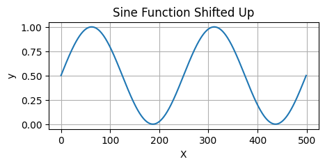
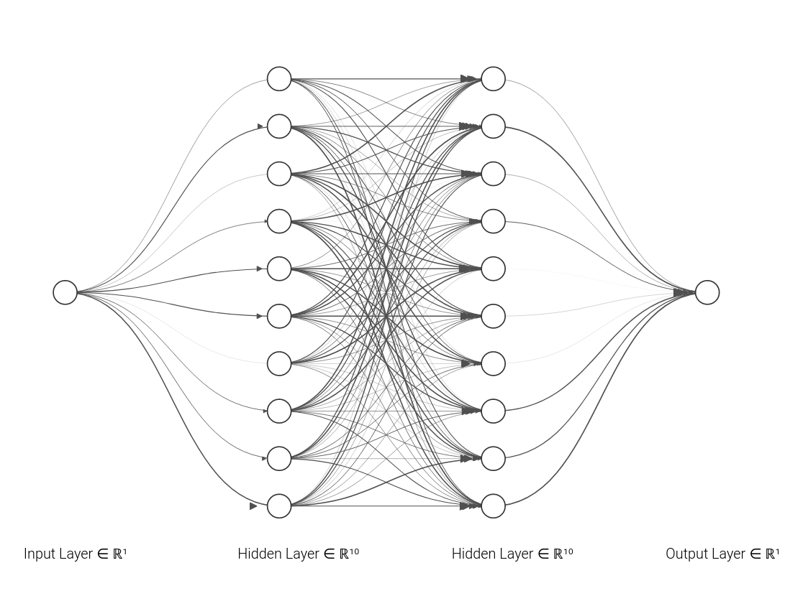
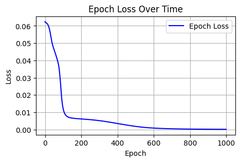
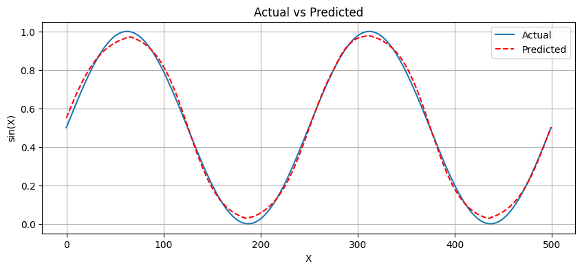
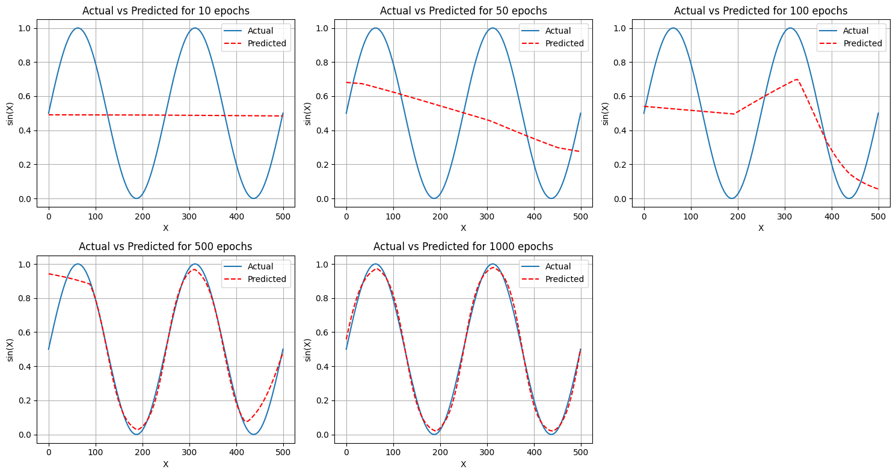

# Neural Network From Scratch

## Table of Contents

1. [Introduction](#introduction)
2. [Importing Libraries](#importing-libraries)
3. [Creating a One Hidden Layer Network](#creating-a-one-hidden-layer-network)
    - [Weight Initialization](#weight-initialization)
    - [Activation Functions](#activation-functions)
    - [Forward Pass](#forward-pass)
4. [Deep Neural Network](#deep-neural-network)
    - [Weight Initialization for Deep Networks](#weight-initialization-for-deep-networks)
    - [Forward Pass in Deep Layers](#forward-pass-in-deep-layers)
5. [Cost Function](#cost-function)
6. [Neural Network Class Implementation](#neural-network-class-implementation)
7. [Backpropagation](#backpropagation)
    - [Gradient Calculation](#gradient-calculation)
    - [Backward Pass Function](#backward-pass-function)
8. [Parameter Update](#parameter-update)
9. [Training the Neural Network](#training-the-neural-network)
    - [Dataset Preparation](#dataset-preparation)
    - [Training Process](#training-process)
    - [Epoch Loss Plot](#epoch-loss-plot)
10. [Results and Visualization](#results-and-visualization)
    - [Actual vs Predicted Plot](#actual-vs-predicted-plot)
    - [Results at Different Epochs](#results-at-different-epochs)
11. [Bash Script for Training](#bash-script-for-training)
12. [References](#references)

In this notebook I will be creating Neural Network from scratch. The approach follows Andrew NG ones.

First I will import the numpy library


```python
import numpy as np
```

I will create a one hidden layer network.

It will have `n_x` input, `n_h` nodes in the hidden layer and 1 output .


```python
def initialize_wights(n_x,n_h):
    # Weight of the W1 will be (n_h,n_x)
    # Multiplied with 0.01 to make it near zero and help in training
    W1 = np.random.randn(n_h,n_x) * 0.01
    b1 = np.random.randn(n_h,1) * 0.01
    W2 = np.random.randn(1,n_h) * 0.01
    b2 = np.random.randn(1,1) * 0.01

    parameters = {
        "W1" : W1,
        "b1" : b1,
        "W2" : W2,
        "b2" : b2
    }

    return parameters

```


```python
def sigmoid(x):
    output = 1 / (1 + np.exp(-x))
    return output
```


```python
def relu(x):
    output = np.maximum(0,x)
    return output
```


```python
def forward_pass(X , parameters) :
    z1 = np.dot(parameters['W1'],X) + parameters['b1']
    a1 = relu(z1)
    z2 = np.dot(parameters['W2'], a1) + parameters['b2']
    a2 = sigmoid(z2)
    return a2
```

## Now for L layer Deep Neural Network


```python
def initialize_wights_deep(layer_list):

    # layer_list contains the info of the neural network
    # It can be like [3,4,5,1]
    # This means the input is 3, there are two hidden layers with 4 and 5 nodes respectively and 1 output

    parameters = {}
    no_layers = len(layer_list)

    for l in range(1, no_layers) :
        parameters["W" + str(l)] = np.random.randn(layer_list[l],layer_list[l-1]) * 0.01
        parameters["b" + str(l)] = np.random.randn(layer_list[l],1) * 0.01
        
    return parameters

```

Now doing forward pass in deep layers


```python
def deep_forward(X,parameters):
    no_weights = len(parameters)//2
    A_temp = X
    for l in range(1,no_weights):
        z = np.dot(parameters["W" + str(l)], A_temp) 
        a = relu(z)
        A_temp = a
    
    Z = np.dot(parameters["W" + str(no_weights)], A_temp)
    A = sigmoid(Z)
    return A
```


```python
layer_list = [3,4,5,6,7,8,9,1]

parameters = initialize_wights_deep(layer_list)
x  = np.random.randn(3,1)
```


```python
deep_forward(X= x , parameters= parameters)
```

    array([[0.5]])

Our model works and forward pass works perfectly. Now our task is to perform back propagation but we need the cost function for that.

## Cost Function

Cost Function used for this project is` mean square error`

$$ \text{MSE} = \frac{1}{n} \sum_{i=1}^{n} (y_i - \hat{y}_i)^2 $$

where:
- $ n $ is the number of data points,
- $ y_i $ is the actual value of the $i$-th data point,
- $ \hat{y}_i $ is the predicted value of the $i$-th data point.

For a single datapoint (i.e., $ n = 1 $), the formula simplifies to:

$$ \text{MSE} = (y - \hat{y})^2 $$

where:
- $ y $ is the actual value,
- $ \hat{y} $ is the predicted value.


```python
def cost_function(Y, AL) :
    # Y is the target
    # AL is the predicted output
    error = Y - AL
    # we will use mean square error
    # 1/2 is added for easier gradient calculation
    cost = (1/2) * (error)**2
    return cost
```

## Now lets convert all the code into Class Module


```python
class NeuralNetwork():
    def __init__(self,layer_list = [1,3,1]) -> None:
        self.layer_list = layer_list
        self.parameters = self.initialize_wights_deep(self.layer_list)

    def sigmoid(self,x):
        output = 1 / (1 + np.exp(-x))
        return output  
        
    def relu(self,x):
        output = np.maximum(0,x)
        return output
    
    def initialize_wights_deep(self,layer_list):
        parameters = {}
        no_layers = len(layer_list)

        for l in range(1, no_layers) :
            parameters["W" + str(l)] = np.random.randn(layer_list[l],layer_list[l-1]) * 0.01
            parameters["b" + str(l)] = np.random.randn(layer_list[l],1) * 0.01
            
        return parameters

    def deep_forward(self,X):
        no_weights = len(self.parameters)//2
        A_temp = X
        for l in range(1,no_weights):
            z = np.dot(self.parameters["W" + str(l)], A_temp) 
            a = self.relu(z)
            A_temp = a
        
        Z = np.dot(self.parameters["W" + str(no_weights)], A_temp)
        A = self.sigmoid(Z)
        return A

    def cost_function(self,Y, AL) :
        # Y is the target
        # AL is the predicted output
        error = Y - AL
        # we will use mean square error
        cost = (1/2) * (error)**2
        return cost
```

Now lets check our class implementation.

```python
model = NeuralNetwork(layer_list= [3,4,5,6,7,8,9,1])
X = np.random.randn(3,1)
AL = model.deep_forward(X= X)
model.cost_function(Y=1 , AL= AL)
```
    array([[0.125]])

## Backpropagation 

The cost function will be the convex function which we have to optimize. We have to choose the parameters value in such a way that the cost function is minimum. For that we use Gradient Descent.

**Derivative of sigmoid function** 

if $\sigma(x)$ is the sigmoid function then its derivative is given as ;

$$
\sigma'(x) = \frac{d}{dx}\sigma(x) =  \sigma(x) (1 - \sigma(x))
$$

**Derivative of Relu function** 

if f(x) is the  function then its derivative is given as ;

$$
f'(x) = f(x)
$$

### Gradient Calculation

Let us consider we have L layers in the network. Now for a $l_{th}$ layer, we have  
$Z^{[l]} = W^{[l]} A^{[l-1]} + b^{[l]}$   
And then it is passed to the activation function.  
Let $g(x)$ be the activation function of the $l_{th}$ layer. Then,  
$A^{[l]} = g(Z^{[l]})$  

For the final layer, $A^{[l]}$ will be the predicted output. Then if we have to find the gradients of the weight with respect to the loss function, then we use chain rule to calculate it. For example :

$$
\frac{\partial L_{fn}}{\partial W} = \frac{\partial L_{fn}}{\partial A} *  \frac{\partial A}{\partial Z} * \frac{\partial Z}{\partial W}
$$

Let 
$$
dZ^{[l]} = \frac{\partial L_{fn}}{\partial Z^{[l]}} = \frac{\partial L_{fn}}{\partial A^{[l]}} *  \frac{\partial A^{[l]}}{\partial Z^{[l]}}
$$

Also,

$A^{[l]} = g(Z^{[l]})$  

`NOTATION USED FOR CODING :`   
 $\frac{\partial L_{fn}}{\partial X} = dX$


Thus,

$$dZ^{[l]} = dA^{[l]} * g'(Z^{[l]})$$    
Where `g()` is the activation function  

Also 

$Z^{[l]} = W^{[l]} A^{[l-1]} + b^{[l]}$   

So,
$$
\frac{\partial Z^{[l]}}{\partial W^{[l]}} = A^{[l-1]} \\
\frac{\partial Z^{[l]}}{\partial b^{[l]}} = 1
$$

Now if we have  $dZ^{[l]}$ , we can calulate others as :

$$ dW^{[l]} = \frac{\partial L_{fn} }{\partial W^{[l]}} =  dZ^{[l]} A^{[l-1] T} $$
$$ db^{[l]} = \frac{\partial L_{fn} }{\partial b^{[l]}} =   dZ^{[l]}$$
$$ dA^{[l-1]} = \frac{\partial L_{fn} }{\partial A^{[l-1]}} = W^{[l] T} dZ^{[l]} $$


So, when doing a `forward pass`, we have to store the output of each layers (`cache`) as, it will be used in calculating `gradients`.


```python
def deep_forward(self,X):
    self.cache = []
    no_weights = len(self.parameters)//2
    A_temp = X
    for l in range(1,no_weights):
        z = np.dot(self.parameters["W" + str(l)], A_temp) + self.parameters["b" + str(l)]
        a = self.relu(z)
        temp_cache =(z,self.parameters["W" + str(l)],self.parameters["b" + str(l)],A_temp)
        self.cache.append(temp_cache)
        A_temp = a 
        
    Z = np.dot(self.parameters["W" + str(no_weights)], A_temp) + self.parameters["b" + str(no_weights)]
    A = self.sigmoid(Z)
    temp_cache = (Z,self.parameters["W" + str(no_weights)],self.parameters["b" + str(no_weights)],A_temp)
    self.cache.append(temp_cache)
    return A
```

Cache order = (`Activation Output(A)`, `Net Output(Z)`, `W`, `b`, $A^{[l-1]}$)

Lets create backward pass function

$$dZ^{[l]} = dA^{[l]} * g'(Z^{[l]})$$   

If, the Cost or loss function used is Mean Squared Error.

For a non vector implementation, i.e for a single input data passed at a time, there will be a target($Y$) and a predicted output($AL$).

Then,

dAL = Loss(Error) = $ Y - AL  $  
Now,

$ \text{Cost Function} (L_{fn}) = \frac{1}{2} * {(Y - AL)}^2 =  \frac{1}{2} * {Loss}^2 $

So,

$$
dAL = \frac{\partial L_{fn}}{\partial AL} = \frac{1}{2} * 2 * (Y - AL) * (-1) \\
dAL = - (Y - AL)
$$


$$ dW^{[l]} = \frac{\partial L_{fn} }{\partial W^{[l]}} =  dZ^{[l]} A^{[l-1] T} $$
$$ db^{[l]} = \frac{\partial L_{fn} }{\partial b^{[l]}} =   dZ^{[l]}$$
$$ dA_{prev} = dA^{[l-1]} = \frac{\partial L_{fn} }{\partial A^{[l-1]}} = W^{[l] T} dZ^{[l]} $$

### Code implementation


```python
def sigmoid_derivative(Z):
    s = sigmoid(Z)
    return s * (1 - s)
```


```python
def relu_derivative(Z):
    return np.where(Z > 0, 1, 0)
```


```python
def backward_pass(Y_target, AL, cache):
    grads = {}
    no_layers = len(cache)
    Y_target = Y_target.reshape(AL.shape)
    dAL = -(Y_target - AL)
    
    # The final output activation used is sigmoid
    Z_cache,W_cache,b_cache, A_prev_cache = cache[-1]
    dZ = dAL * sigmoid_derivative(Z_cache)
    dW_temp = np.dot(dZ, A_prev_cache.T)
    db_temp = dZ
    dA_prev_temp = np.dot(W_cache.T, dZ)
    
    grads["dA" + str(no_layers - 1)] = dA_prev_temp
    grads["dW" + str(no_layers)] = dW_temp
    grads["db" + str(no_layers)] = db_temp

    for l in reversed(range(no_layers - 1)):
        Z_cache,W_cache,b_cache, A_prev_cache = cache[l]
        # Relu activation has been used 
        dZ = np.array(dA_prev_temp,copy= True)
        dZ[Z_cache <= 0] = 0 
        dW_temp = np.dot(dZ, A_prev_cache.T)
        db_temp = dZ
        dA_prev_temp = np.dot(W_cache.T, dZ)
        
        grads["dA" + str(l)] = dA_prev_temp
        grads["dW" + str(l + 1)] = dW_temp
        grads["db" + str(l + 1)] = db_temp
            
    return grads
```

Lets Check Whether our backward pass works or not.Let `Y_target` be 1


```python
Y_target = 1
backward_grad = backward_pass(
    Y_target= np.array([Y_target], dtype = np.float64 ) ,
    AL = output, cache = model.cache )
```


```python
for key in backward_grad.keys():
    print(f"{key} : {backward_grad[key].shape}")
```

    dA1 : (4, 1)
    dW2 : (1, 4)
    db2 : (1, 1)
    dA0 : (3, 1)
    dW1 : (4, 3)
    db1 : (4, 1)


```python
layer_no = 1
for c in model.cache :
    Z_cache,W_cache,b_cache, A_prev_cache = c
    print(f" W_cache{str(layer_no)} : {W_cache.shape}")
    print(f" b_cache{str(layer_no)} : {b_cache.shape}")
    print(f" A_prev_cache{str(layer_no)} : {A_prev_cache.shape}")
    layer_no += 1 
```

     W_cache1 : (4, 3)
     b_cache1 : (4, 1)
     A_prev_cache1 : (3, 1)
     W_cache2 : (1, 4)
     b_cache2 : (1, 1)
     A_prev_cache2 : (4, 1)


Thus our shape and size matches. Our backpropagation works.

## Parameter Update

Now updating parameters using the formula :
$$ W^{[l]} = W^{[l]} - \alpha \text{ } dW^{[l]} $$
$$ b^{[l]} = b^{[l]} - \alpha \text{ } db^{[l]} $$

Where $\alpha$ is the learning rate

### Code Implementation


```python
def update_parameters(params, grads, learning_rate):

    parameters = params
    L = len(parameters) // 2  
    for l in range(L):  
        parameters["W" + str(l+1)] = parameters["W" + str(l+1)] - learning_rate * grads["dW" + str(l+1)] 
        parameters["b" + str(l+1)] = parameters["b" + str(l+1)] - learning_rate * grads["db" + str(l+1)] 
    return parameters
```


```python
parameters = model.parameters
parameters_updated = update_parameters(params= parameters , grads= backward_grad , learning_rate= 0.01)
```


```python
parameters_updated
```


    {'W1': array([[ 0.00375298,  0.01316039,  0.00355996],
            [ 0.00446401,  0.03684394, -0.00615335],
            [ 0.00850821,  0.01395093,  0.01171703],
            [-0.01454772, -0.00176866,  0.00351362]]),
     'b1': array([[ 0.00147138],
            [-0.00585842],
            [-0.0172551 ],
            [-0.00457214]]),
     'W2': array([[-0.01229051, -0.00092437, -0.02255535,  0.01892372]]),
     'b2': array([[-0.0046815]])}


# Class Implementation


```python
class NeuralNetwork():
    def __init__(self,layer_list = [1,3,1]) -> None:
        self.layer_list = layer_list
        self.parameters = self.initialize_weights_deep(self.layer_list)
        self.cache = []
        self.epoch_loss = []

    def sigmoid(self,x):
        output = 1 / (1 + np.exp(-x))
        return output
        
    def relu(self,x):
        output = np.maximum(0,x)
        return output
    
    def initialize_weights_deep(self,layer_list):
        parameters = {}
        no_layers = len(layer_list)

        for l in range(1, no_layers) :
            parameters["W" + str(l)] = np.random.randn(layer_list[l],layer_list[l-1]) * 0.1
            parameters["b" + str(l)] = np.random.randn(layer_list[l],1) * 0.1
            
        return parameters

    def deep_forward(self,X):
        self.cache = []
        no_weights = len(self.parameters)//2
        A_temp = X
        for l in range(1,no_weights):
            z = np.dot(self.parameters["W" + str(l)], A_temp) + self.parameters["b" + str(l)]
            a = self.relu(z)
            temp_cache =(z,self.parameters["W" + str(l)],self.parameters["b" + str(l)],A_temp)
            self.cache.append(temp_cache)
            A_temp = a 
            
        Z = np.dot(self.parameters["W" + str(no_weights)], A_temp) + self.parameters["b" + str(no_weights)]
        A = self.sigmoid(Z)
        temp_cache = (Z,self.parameters["W" + str(no_weights)],self.parameters["b" + str(no_weights)],A_temp)
        self.cache.append(temp_cache)
        return A
    
    def backward_pass(self,Y_target, AL):
        grads = {}
        no_layers = len(self.cache)
        Y_target = Y_target.reshape(AL.shape)
        dAL = -(Y_target - AL)
        
        # The final output activation used is sigmoid
        Z_cache,W_cache,b_cache, A_prev_cache = self.cache[-1]
        dZ = dAL * self.sigmoid_derivative(Z_cache)
        dW_temp = np.dot(dZ, A_prev_cache.T)
        db_temp = dZ
        dA_prev_temp = np.dot(W_cache.T, dZ)
        
        grads["dA" + str(no_layers - 1)] = dA_prev_temp
        grads["dW" + str(no_layers)] = dW_temp
        grads["db" + str(no_layers)] = db_temp

        for l in reversed(range(no_layers - 1)):
            Z_cache,W_cache,b_cache, A_prev_cache = self.cache[l]
            # Relu activation has been used 
            dZ = np.array(dA_prev_temp,copy= True)
            dZ[Z_cache <= 0] = 0 
            dW_temp = np.dot(dZ, A_prev_cache.T)
            db_temp = dZ
            dA_prev_temp = np.dot(W_cache.T, dZ)
            
            grads["dA" + str(l)] = dA_prev_temp
            grads["dW" + str(l + 1)] = dW_temp
            grads["db" + str(l + 1)] = db_temp
                
        return grads

    def update_parameters(self, grads, learning_rate):
        L = len(self.parameters) // 2  
        for l in range(L):  
            self.parameters["W" + str(l+1)] = self.parameters["W" + str(l+1)] - learning_rate * grads["dW" + str(l+1)] 
            self.parameters["b" + str(l+1)] = self.parameters["b" + str(l+1)] - learning_rate * grads["db" + str(l+1)] 


    def train(self, X,y, learning_rate, epochs = 10 , verbose_epoch = 10, verbose = True) :
        self.epoch_loss = []
        dataset_length = len(X)
        for epoch in range(epochs) :
            cost = 0 
            for iter in range(0,dataset_length) :
                out = self.deep_forward(X[iter])
                cost += self.cost_function(Y= y[iter] , AL = out)
                grad = self.backward_pass(Y_target= y[iter] , AL = out)
                self.update_parameters(grads = grad, learning_rate= learning_rate)
            cost = cost/dataset_length
            if epoch % verbose_epoch == 0 and verbose:
                print(f"Epoch {epoch} Loss : {cost[0][0]}")
            self.epoch_loss.append(cost[0][0])
        
    def cost_function(self,Y, AL) :
        # Y is the target
        # AL is the predicted output
        error = Y - AL
        # we will use mean square error
        cost = (1/2) * (error)**2
        return cost
    
    def sigmoid_derivative(self,Z):
        s = self.sigmoid(Z)
        return s * (1 - s)
        
    def plot_epoch(self):
        plt.figure(figsize=(5,3))
        plt.plot(self.epoch_loss, linestyle='-', color='b', label='Epoch Loss')
        plt.title('Epoch Loss Over Time')
        plt.xlabel('Epoch')
        plt.ylabel('Loss')
        plt.legend()
        plt.grid(True)
        plt.show()

    def clear_weights(self):
        self.parameters = self.initialize_weights_deep(self.layer_list)
    
```

Lets create a random dataset to train the model we just created.


```python
num_samples = 500
X = np.linspace(-2 * np.pi, 2 * np.pi, num_samples).reshape(num_samples,1,1)
y = 0.5 * (np.sin(X) + 1)

# Normalize input data
X_norm = (X - X.mean()) / X.std()
```

Since we have used `sigmoid` function in the last layer activation function, Our output will be in the range 0 to 1 . So we shifted our output sinx.


```python
# Plotting
plt.figure(figsize=(5, 2))
plt.plot(y[: , 0])
plt.title('Sine Function Shifted Up')
plt.xlabel('X')
plt.ylabel('y')
plt.grid(True)
plt.show()
```


    

    


## Training

Our input has 500 sample data. lets create a neural network with `2` hidden layers with `10` node in first and second hidden layer.

Thus our neural network architecture is as :


```python
# Initialize and train the neural network
layers_architecture = [1,10,10,1]
nn = NeuralNetwork(layer_list= layers_architecture)
```

Our neural network will be like this :


```python
nn.train(X_norm, y, learning_rate=0.01, epochs = 1000 , verbose_epoch = 200 ) 
nn.plot_epoch() 
```

    Epoch 0 Loss : 0.06244991205951288
    Epoch 200 Loss : 0.006165241866946359
    Epoch 400 Loss : 0.003518060336533567
    Epoch 600 Loss : 0.0008731145749017363
    Epoch 800 Loss : 0.00029580651557426115


    

    


## Lets see the actual and predicted plot


```python
y_pred = np.array([nn.deep_forward(x.reshape(-1, 1))[0][0] for x in X_norm])
```


```python
# Plot predictions
plt.figure(figsize=(10, 4))
plt.plot( y[:,0], label='Actual')
plt.plot( y_pred, label='Predicted', linestyle='dashed' , color ='r')
plt.title('Actual vs Predicted')
plt.xlabel('X')
plt.ylabel('sin(X)')
plt.legend()
plt.grid(True)
plt.show()
```


    

    


## Results at different epochs
 
Lets See how our neural network outputs look at different epochs


```python
import numpy as np
import matplotlib.pyplot as plt

def plot_actual_vs_predicted(nn, X_norm, y, learning_rate=0.01):
    epochs_list = [10, 50, 100, 500, 1000]
    
    plt.figure(figsize=(15, 8))
    
    for i, epochs in enumerate(epochs_list):
        # Train the model
        nn.train(X_norm, y, learning_rate=learning_rate, epochs=epochs, verbose = False)
        
        # Generate predictions
        y_pred = np.array([nn.deep_forward(x.reshape(-1, 1))[0][0] for x in X_norm])
        
        # Plot predictions
        plt.subplot(2, 3, i + 1)
        plt.plot(y[:, 0], label='Actual')
        plt.plot(y_pred, label='Predicted', linestyle='dashed', color='r')
        plt.title(f'Actual vs Predicted for {epochs} epochs')
        plt.xlabel('X')
        plt.ylabel('sin(X)')
        plt.legend()
        plt.grid(True)
    
    plt.tight_layout()
    plt.show()
```


```python
layers_architecture = [1,10,10,1]
nn = NeuralNetwork(layer_list= layers_architecture)
plot_actual_vs_predicted(nn, X_norm, y)
```


    

    


## Bash Script Code
To train the Neural Network use the following bash script.


```bash
python train.py --layers 1 10 10 1 --learning_rate 0.01 --epochs 1000 --verbose_epoch 200
```
